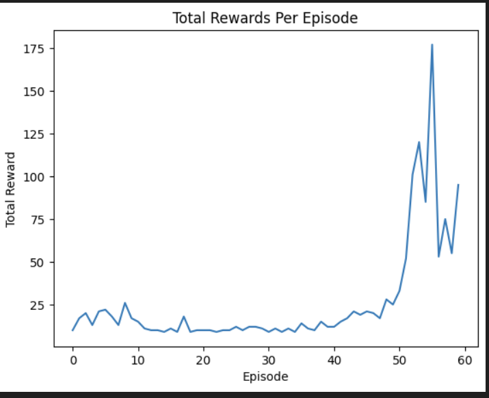
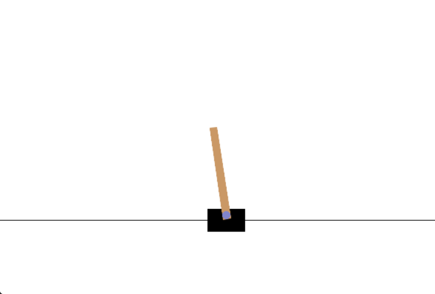

# Deep Q-Network (DQN) for CartPole-v1

This repository contains the implementation of a Deep Q-Network (DQN) to solve the **CartPole-v1** environment from OpenAI's Gym. The goal of the agent is to balance a pole on a cart by taking actions that either move the cart left or right, ensuring that the pole remains upright as long as possible.

## Project Overview

The project implements the DQN algorithm, a reinforcement learning method that uses deep neural networks to approximate the Q-values. The network learns by interacting with the environment and improving its performance over time using the following components:

- **Experience Replay**: Storing past experiences and sampling random mini-batches for training.
- **Target Network**: A secondary network used to stabilize training by updating it periodically with the main network's weights.
- **Epsilon-Greedy Exploration**: The agent initially explores the environment randomly and gradually shifts towards exploiting the learned policy as it gains more experience.

<h3>Output Code</h3>

  
  

